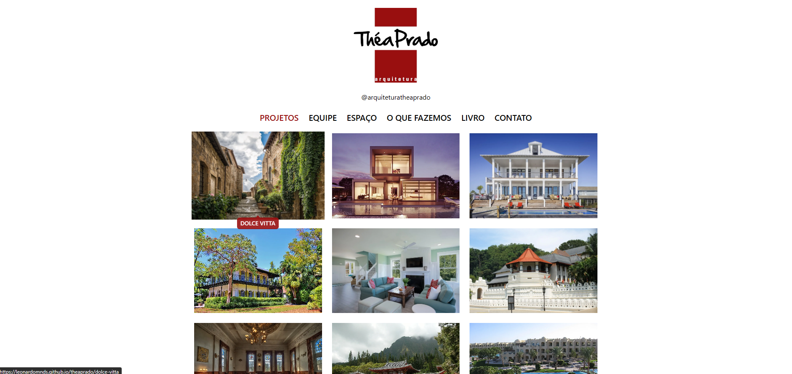

# Site para Théa Prado Arquitetura (Protótipo)

Este projeto é um site desenvolvido para a o escritório de arquitetura Théa Prado, utilizando Angular com geração de site estático (SSG - Static Site Generation) e publicado no GitHub Pages.



## Tecnologias Utilizadas

- **Angular**: Framework de desenvolvimento web utilizado para construir a interface do usuário.
- **GitHub Pages**: Serviço de hospedagem utilizado para publicar o site.

## Sessões

- **Projetos**: Galeria com os projetos realizados pelo escritório.
- **Equipe**: Apresentação da equipe que trabalha nos projetos.
- **Espaço**: Apresentação do espaço físico do escritório.
- **O que fazemos**: Apresentação dos tipos de trabalhos realizados.
- **Livro**: Apresentação sobre um Livro de Projetos comercializado pela empresa.
- **Contato**: Dados para contato com o escritório.

## Como Rodar o Projeto Localmente

- **Clone o repositório**:

```sh
  git clone https://github.com/leonardomnds/theaprado.git
  cd theaprado
```

- **Instale as dependências**:

```sh
  npm install
```

- **Rodar o servidor de desenvolvimento**:

```sh
  npm run serve
```

- **Acesse o site**:

  Abra o navegador e vá para [http://localhost:4200](http://localhost:4200).

## Licença

Este projeto está licenciado sob a licença MIT. Veja o arquivo [LICENSE](LICENSE) para mais detalhes.
